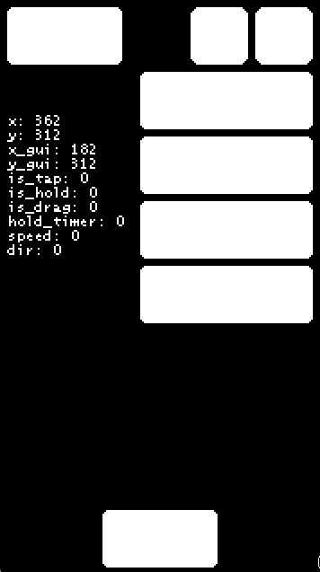

Make a good and structured folder system in this folder to keep your files organized.

Example folder structure for organizing your images and animation sources:
```
Images/
├── UI/
│   ├── buttons/
│   ├── icons/
│   └── ...
├── Pets/
│   ├── cats/
│   │   ├── cat_1/
│   │   │   ├── size_default/
│   │   │   │   ├── cat_1_icon.png
│   │   │   │   ├── cat_1_idle.png
│   │   │   │   ├── cat_1_sprites.aseprite   # All cat_1 default size animations in one .aseprite file
│   │   │   │   └── ...
│   │   │   ├── size_closeup/
│   │   │   │   ├── cat_1_closeup.png
│   │   │   │   ├── cat_1_closeup_sprites.aseprite   # All closeup animations in one .aseprite file
│   │   │   │   └── ...
│   │   │   └── ...
│   │   └── ...
│   ├── dogs/
│   │   └── ...
│   └── ...
├── Scenes/
│   ├── home.png
│   ├── hotel.png
│   └── ...
├── Map/
│   ├── world-map.png
│   └── ...
└── ...
```

Dimensjon forslag:
- Skjerm: 90x160  16:9
- Hoved-Rom: 270x160
- Pet: 32x32
- Knapper: 16x16 -> 32x16 -> 48x16 -> 64x16

Eksempel på gammel størelse (180x320):



Knapper som trengs:
- Hamburgermeny (16x16)
- Notifications (bjelle, 16x16)
- Knapp for å velge toys (16x32)
- Knapp for å velge furniture
- Knapp for å velge snack
- Knapp for å velge food

Pet bilder:
- Inn i rommet (32x32)
  - Idle
  - Move
  - Jump?
  - Eat
  - Sleep
  - Poop
- Close-up ansikt(128x128)?
